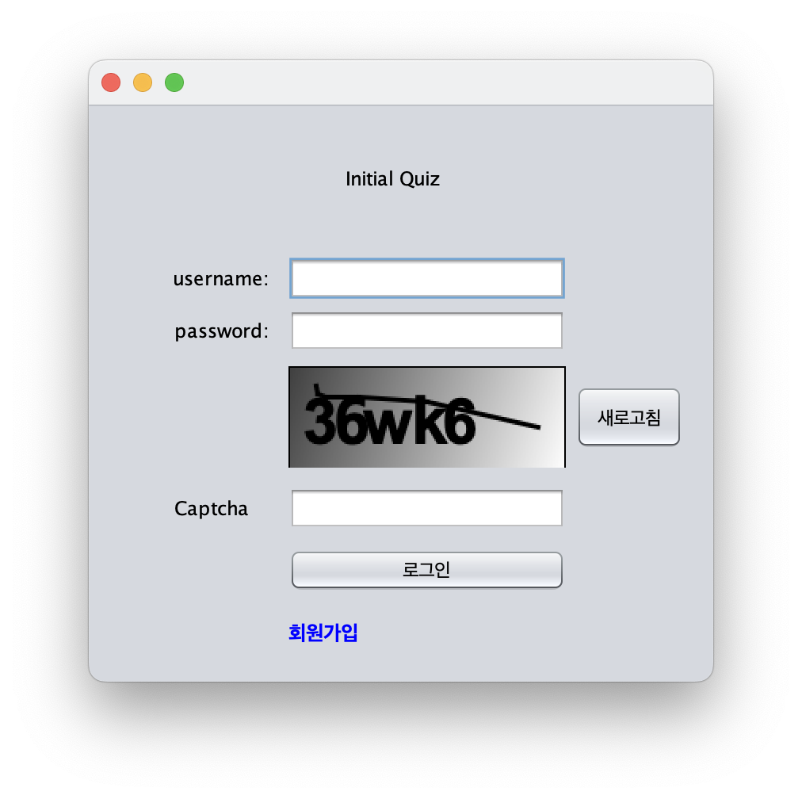

# initial-quiz

초성 퀴즈 게임

## 기술 스택

프로그래밍 언어: `Java`  
GUI: `SWING`  
DATABASE: `MySQL`  
IDE: Apache Netbeans 14  
의존성 파일: mysql-connecto.jar

## 프로젝트 구조

  
src/com/initialquiz

- frame
  - LoginFrame.java
  - SignupFrame.java
  - InGameFrame.java
- controller
  - LoginController.java
  - SignupController.java
  - InitGameController.java
  - UserPointController.java
- service
  - UserService.java
  - QuizService.java
- dao
  - UserDAO.java
  - QuizDAO.java
- dto
  - UserDTO
  - QuizDTO
- db
  - DBConnect.java
  - initial_quiz_schema.sql
  - insertQuery.sql

## 프로젝트 화면

login/ signup  

  
ingame  

  
